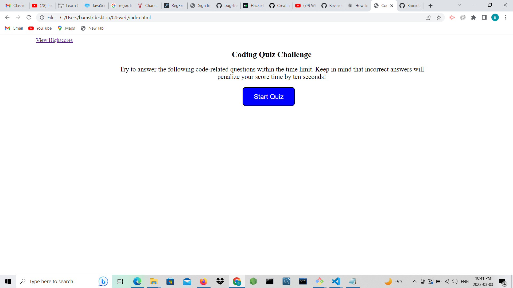
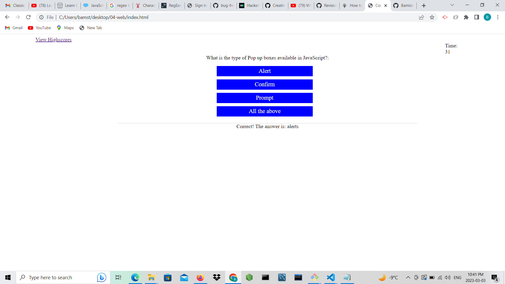

# Web APIs: Code Quiz

This module challenge is based on a timed coding quiz with multiple choice questions. The app runs on the web browser with the implementation of HTML, CSS and JavaScript code that make the page interactive. The user will click on the start quiz button and app will start with multiple choice questions with a count down timer. If the user is able to finish the questions, the app will generate total score and show time left. Equally, if the user can not finish the questions, the app will time out and reveals the user's score.

## Built With:
HTML, CSS and JavaScript code

## Generated images

## Deployed URL and Repository

https://bamidele100.github.io/web-api-code-quiz/

https://github.com/Bamidele100/web-api-code-quiz.git